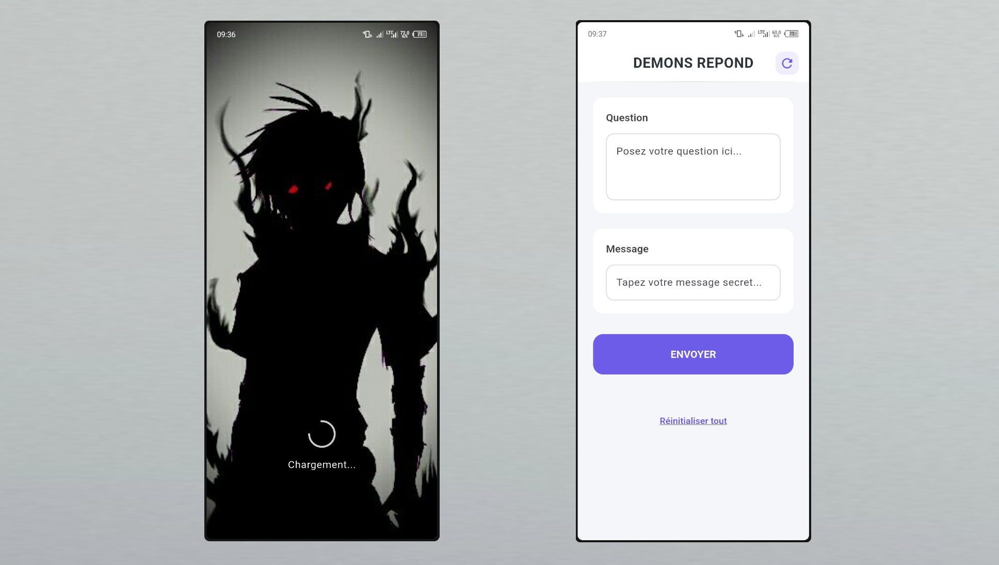

# 🧿 Image pour démons répondants

⚠️ Attention : Ce projet est fourni à titre expérimental. Toute utilisation abusive ou hors du cadre éducatif est fortement déconseillée.

## 🎭 Rôle de l'application

Cette APK a été conçue uniquement à des fins de **simulation**, **expérimentation** ou **divertissement**.  
Elle illustre le fonctionnement d’une communication cachée derrière des messages codés, dans un univers fictif.

## Mode d'utilisation

Dans le champ du **message secret**, saisissez votre message en **commençant par un point `.`**.  
Le contenu sera alors **dissimulé derrière une phrase magique**, telle que : 

« Démon, veux-tu me répondre ? »

🔒 Grâce à ce stratagème, votre véritable message reste **invisible**, **camouflé derrière cette formule énigmatique**.
